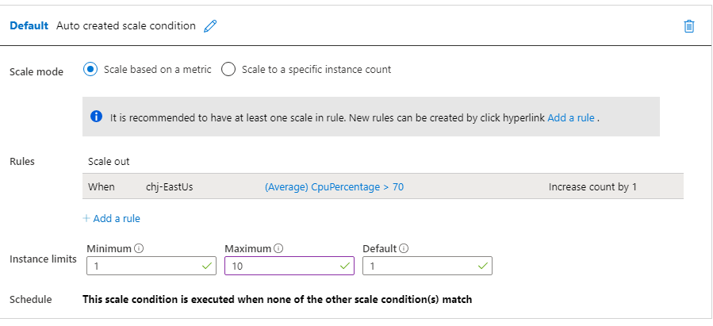
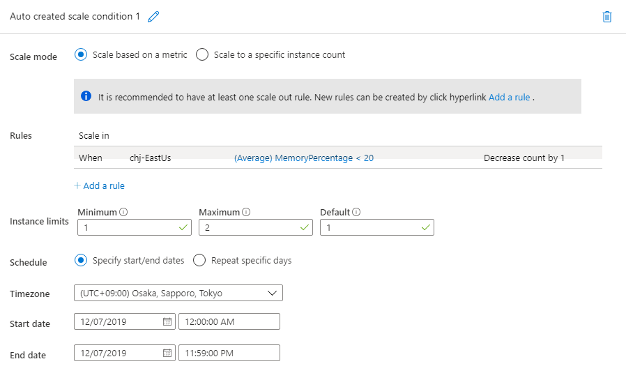

# Azure Web App

## 0. 서비스 생성

워드프레스(Word Press) 로 실습을 진행

`Azure Portal` 의  `creat a resource` 메뉴에서 `WordPress` 를 검색하여 생성한다.

* app의 Service Plan/Location을 설정. 
  * East Us 
  * Pricing tier : `S1 Standard`
* Database server를 선택
  * Admin 설정
  * Pricing tier : `Basic, 2 vCores, 30Gb`

## 1. WordPress 설정

만들때 생성된 도메인 주소로 접속하여 몇가지 설정만 해주면 된다.

* 언어 설정
* 계정 생성

이후 로그인시 관리페이지에 접속된다.

## 2. Deployment slots

배포 전에 Staging slot 에 먼저 배포 후 실제 서비스 하는 프로덕션 슬롯과 교체하는 방식을 사용 할 수 있다.

다음과 같은 장점이 있다.

* 변경 사항을 미리 확인 가능
* 앱의 가동 중지가 발생하지 않는다.
* 문제가 있다면, 슬롯의 재교환을 통해 문제가 발생하지 않았던 마지막 상태로 돌아갈 수 있다.

## 3. Scale up

더 좋은 성능으로의 변경

## 4. Scale out

하나의 장비에서 처리하던것을 여러 장비로 나눠서 처리할 수 있도록 변경

수평 확장

메뉴에서 Automatic scale out 의 조건들을 설정 할 수 있다.

Scale out 과 Scale in 모두 조건을 걸어서 설정 가능.

특정 날짜를 지정 할 수도 있다.

* scale out 의 경우

* scale in으로 설정

